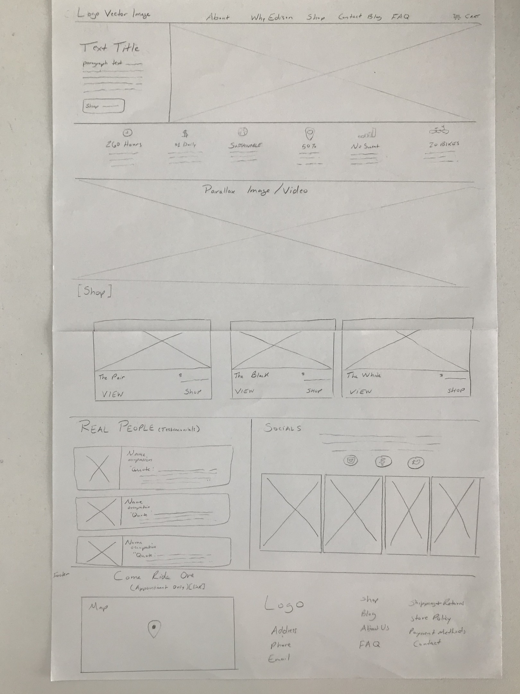
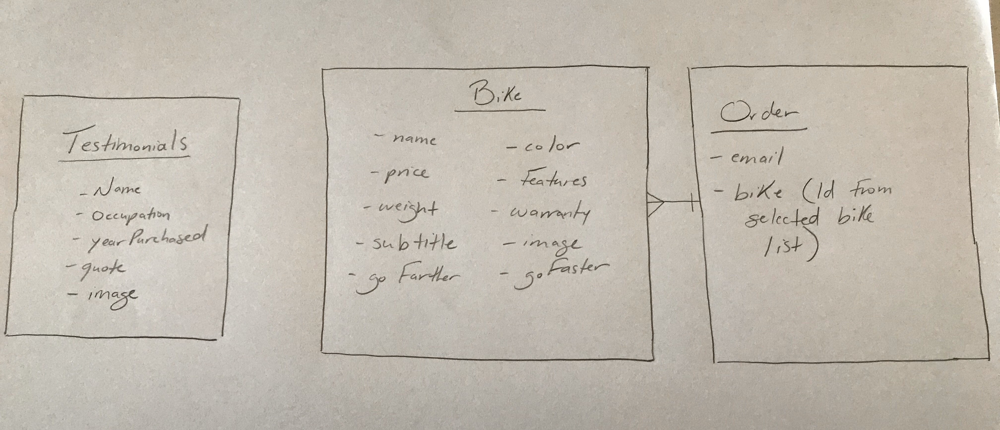

##### Disclaimer: The following code is written as a final project for my General Assembly Software Engineering class. This site is **_not_** the official website for the Edison Electric Bike Co. For access to the official website, please click the following link: [Edison Electic Bike Co.](https://www.edisonbicycles.com/) 

***

# Edison Electric Bike Co.

#### This React-Django Application is the beginning stages of a fully functional eCommerce website for Edison Bike Shop. Users will also be able to view, add, and remove items from the shopping cart. Users will also be able to view the bike specs, preview Edison's social media, read testimonials, and learn statistics about the benefits of using an electric bicycle.

##### Important Links:
[**Deployed Site**](https://fierce-basin-13970.herokuapp.com)

[GitHub Link](https://github.com/brittmagee/SEI23-Project4)

[Project board](https://app.gitkraken.com/glo/board/XZZLIEfrBQAPXd-x)

<dl>
  <dt>Tech Specs</dt>
    <dd>React</dd>
    <dd>JavaScript</dd>
    <dd>Node.js</dd>
    <dd>Django</dd>
    <dd>SQLite</dd>
    <dd>HTML5</dd>
    <dd>CSS</dd>
    <dd>Material UI</dd>
    <dd>Bulma</dd>
</dl>

#### This application has: 

* Three API models – Bikes, Testimonials, and Orders
* CSS styling: A combination of my own CSS, Material UI and Bulma. (Note: Used Semantic to remove the wrapper from the Google map)
* Wireframes that were designed at teh beginning of the planning process.
* ERD
* Deployed online and accessible to the public via Heroku

### Wireframe & ERD Images

